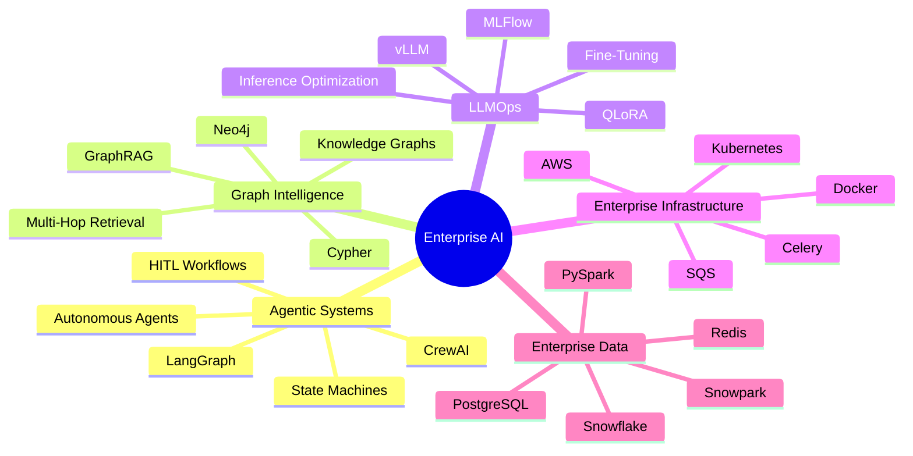
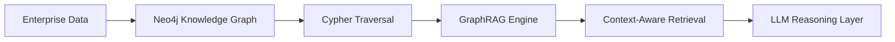
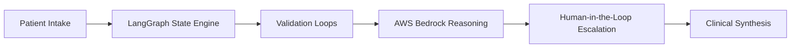
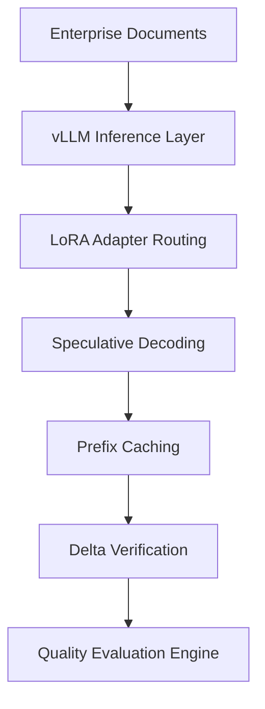

<div align="center">


# ⚡ Enterprise AI Systems Engineer


<br/>

<a href="mailto:pratikreddy01@gmail.com">

</a>

<a href="https://github.com/pratikreddy01">

</a>

<a href="https://linkedin.com/in/pratikreddy01">

</a>

<br/><br/>


</div>

---

<div align="center">


</div>

---


# 🧠 SYSTEM PROFILE

```yaml
name: Pratik Reddy
role: AI Systems Engineer

specialization:
  - Agentic AI Systems
  - GraphRAG Architectures
  - Enterprise LLM Platforms
  - Distributed Inference Systems
  - Autonomous Multi-Agent Workflows

core_engineering_focus:
  - AI Orchestration
  - Reliability Engineering
  - Enterprise AI Infrastructure
  - Reasoning Optimization

currently_building:
  - AI Excel Processing System
  - Graph-Intelligent Enterprise RAG
  - Distributed Agentic Platforms
  - Human-in-the-Loop AI Systems
```

---

# ⚡ SYSTEM INITIALIZATION

```bash
> Initializing Enterprise AI Systems...
> Loading Agentic Orchestration Engine...
> GraphRAG Systems Activated...
> Distributed Inference Layer Online...
> Autonomous Multi-Agent Workflows Ready...
> System Status: OPERATIONAL
```

---


# 🚀 AI ENGINEERING DOMAINS

<div align="center">

| 🤖 Agentic AI | 🌐 Graph Intelligence | ⚡ LLMOps | ☁️ Enterprise AI Infrastructure |
|---|---|---|---|
| LangGraph | Neo4j | vLLM | AWS Bedrock |
| CrewAI | GraphRAG | QLoRA | Kubernetes |
| HITL Systems | Cypher | MLFlow | Snowflake |
| Multi-Agent Systems | Multi-Hop Reasoning | Unsloth | Docker |
| State Machines | Knowledge Graphs | Fine-Tuning | Distributed Systems |

</div>

---

<div align="center">


</div>

---

# 🚀 SYSTEM ARCHITECTURE EXPERTISE



---


# ⚙️ TECHNOLOGY STACK

## 🚀 Languages & Infrastructure

<div align="center">


</div>

---

## 🧠 AI / LLM Ecosystem

<div align="center">


</div>

---


# 🏗️ FEATURED AI SYSTEMS

# 🧠 Knowledge Weaver
### Graph-Augmented Enterprise RAG Platform



### ⚡ Highlights
- Built GraphRAG systems using Neo4j + Cypher
- Enabled multi-hop enterprise reasoning pipelines
- Integrated graph-aware retrieval systems
- Optimized intelligent knowledge traversal
- Designed enterprise-scale reasoning workflows

---

# 🏥 Virtual Pain Clinic
### Agentic Medical Triage Ecosystem



### ⚡ Highlights
- Engineered state-aware orchestration using LangGraph
- Built HITL escalation architecture
- Developed autonomous reasoning pipelines
- Unified fragmented medical systems
- Enabled enterprise AI orchestration

---

# 🌍 Matterhorn
### Distributed Translation & Reasoning Platform



### ⚡ Highlights
- Built distributed inference pipelines using vLLM
- Optimized throughput with speculative decoding
- Engineered async reasoning systems
- Developed automated quality verification
- Enabled multilingual reasoning workflows

---


# 📊 GITHUB ANALYTICS

<div align="center">


</div>

<div align="center">


</div>

---

<div align="center">


</div>

---

# 🌱 CURRENT RESEARCH

```yaml
- Autonomous AI Agents
- MCP Ecosystems
- Long-Term Agent Memory
- AI Observability
- Distributed Multi-Agent Coordination
- Reasoning Optimization
```

---

# ⚡ ENGINEERING PHILOSOPHY

<div align="center">

### “Scalable AI is not just about intelligence — it's about orchestration, reliability, reasoning, and infrastructure.”

</div>

---

<div align="center">


</div>

---

# 🌐 CONNECT WITH ME

<div align="center">

<a href="mailto:pratikreddy01@gmail.com">

</a>

<a href="https://linkedin.com/in/pratikreddy01">

</a>

<a href="https://github.com/pratikreddy01">

</a>

</div>

---

<div align="center">


# ⚡ BUILDING THE FUTURE OF ENTERPRISE AGENTIC AI ⚡

</div>
