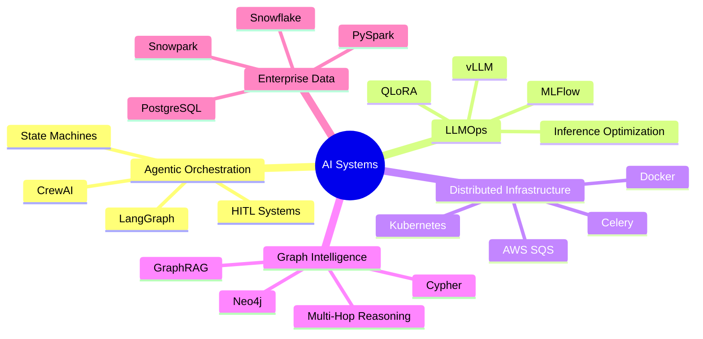
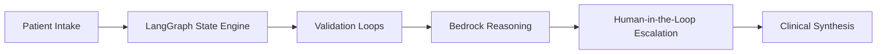
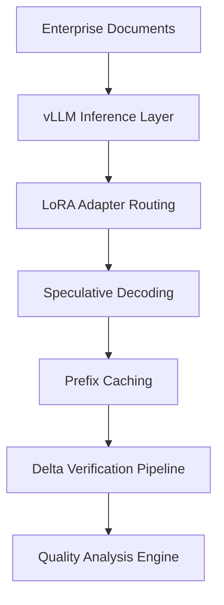
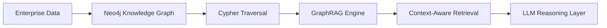

<div align="center">


# ⚡ AI Systems Engineer | Agentic AI • LLMOps • Distributed AI Infrastructure


<p align="center">

<a href="mailto:pratikreddy01@gmail.com">

</a>

<a href="https://github.com/pratikreddy01">

</a>

<a href="https://linkedin.com/in/pratikreddy01">

</a>

</p>


</div>

---

# 💫 About Me

```yaml
name: Pratik Reddy
role: AI Systems Engineer

specialization:
  - Agentic AI Systems
  - LLMOps & Fine-Tuning
  - Distributed AI Infrastructure
  - GraphRAG Systems
  - Enterprise AI Platforms

currently_building:
  - Production-grade multi-agent orchestration systems
  - Distributed inference layers using vLLM
  - Graph-intelligent enterprise RAG ecosystems
  - Human-in-the-loop autonomous workflows

core_focus:
  - Reliability
  - Scalability
  - Autonomous reasoning
  - Enterprise AI architecture
  - Low-latency inference systems
```

---

# 🚀 Engineering Domains

<div align="center">

| 🤖 Agentic AI | ⚡ LLMOps | 🌐 Graph Intelligence | ☁️ Enterprise Infrastructure |
|---|---|---|---|
| LangGraph | QLoRA | Neo4j | AWS Bedrock |
| CrewAI | vLLM | Cypher | Snowflake Cortex |
| Multi-Agent Loops | Unsloth | GraphRAG | Snowpark |
| State Machines | MLFlow | Multi-Hop Reasoning | Kubernetes |
| HITL Workflows | Fine-Tuning | Vector Intelligence | Distributed Systems |

</div>

---

# 🧠 System Design Expertise

<div align="center">



</div>

---

# ⚙️ Tech Stack

## 🚀 Languages & Core Engineering

<p align="center">

</p>

---

## 🧠 AI / LLM Ecosystem

<p align="center">


</p>

---

## ☁️ Cloud & Enterprise Platforms

<p align="center">


</p>

---

# 🏗️ Featured Production Systems

# 🏥 Virtual Pain Clinic
### Agentic Medical Triage Ecosystem



### 🔹 Highlights
- Built state-aware clinical orchestration using LangGraph + AWS Bedrock
- Implemented HITL escalation architecture for medical state editing
- Engineered Pydantic validation loops for high-precision intake
- Unified fragmented medical systems through FastAPI tool brokerage
- Enabled autonomous reasoning workflows with enterprise-grade reliability

---

# 🌍 Matterhorn
### High-Throughput Translation & Reasoning Platform



### 🔹 Highlights
- Architected distributed inference pipelines using vLLM + LoRA adapters
- Optimized throughput with speculative decoding + prefix caching
- Built async reasoning pipelines with Celery + AWS SQS
- Designed automated LLM-based quality verification systems
- Enabled enterprise-scale multilingual reasoning workflows

---

# 🧠 Knowledge Weaver
### Graph-Augmented Enterprise RAG Platform



### 🔹 Highlights
- Engineered GraphRAG systems with Neo4j + Cypher
- Enabled multi-hop enterprise reasoning pipelines
- Built context-aware versioning with FastAPI + OpenAI APIs
- Reduced retrieval latency using graph-intelligent traversal
- Integrated vector intelligence with graph-based reasoning

---

# 📊 GitHub Analytics

<div align="center">


</div>

---

# 🏆 GitHub Trophies

<div align="center">


</div>

---

# 📜 Certifications & Education

<div align="center">

| 🎓 Qualification | Institution |
|---|---|
| SnowPro Core Certified Professional | Snowflake |
| PG Diploma - Big Data Analytics | CDAC Pune |
| Bachelor of Engineering | JNE College |

</div>

---

# 💼 Experience

<div align="center">

| Company | Role | Timeline |
|---|---|---|
| 64 Squares LLC | AI Engineer | Sept 2024 – Present |

</div>

---

# 🌱 Currently Exploring

```yaml
- Autonomous AI Agents
- MCP Protocol Ecosystems
- Long-Term Agent Memory
- AI Observability
- Reasoning Optimization
- Reinforcement Learning for Agents
- Distributed Multi-Agent Coordination
```

---

# ✨ Engineering Philosophy

<div align="center">

### “Scalable AI is not just about intelligence — it's about orchestration, reliability, and infrastructure.”

</div>

---

# 🌐 Connect With Me

<div align="center">

<a href="mailto:pratikreddy01@gmail.com">

</a>

<a href="https://linkedin.com/in/pratikreddy01">

</a>

<a href="https://github.com/pratikreddy01">

</a>

</div>

---

<div align="center">


## ⚡ Building the Future of Enterprise Agentic AI ⚡

</div>
